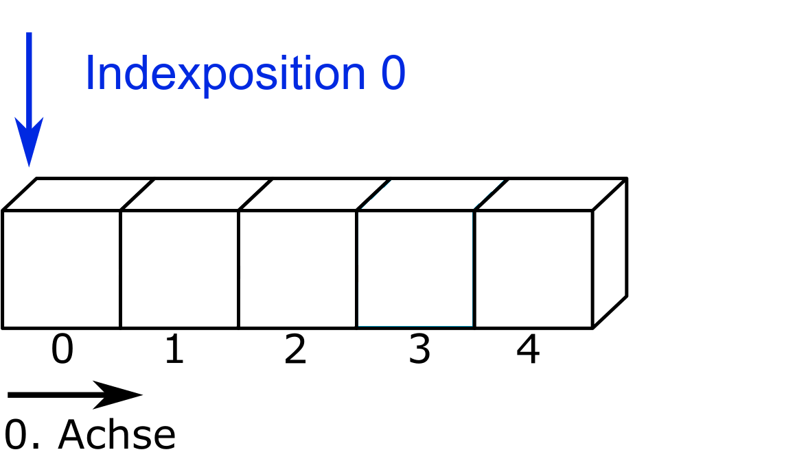
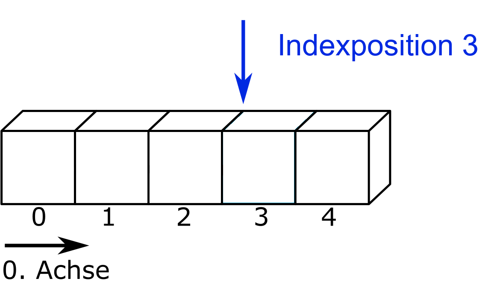

# Reading and writing files
Maya and Hans each rolled a die six times and recorded their results in a `.txt` file. We want to evaluate the files using Python in order to determine which of the two achieved the higher total number of pips.

| Data | File name |
|---|------|
| Dice results Maya | dice-maya.txt |
| Dice results Hans | dice-hans.txt |

&nbsp;

## File objects
In order to access a file with Python, it must be opened for reading or writing. For this purpose, Python provides the function [open](https://docs.python.org/3/library/functions.html#open). It takes two arguments—the file path and the access mode—and returns a [file object](https://docs.python.org/3/glossary.html#term-file-object). The contents of the file are then read from this file object.

### File path
The local file path is specified relative to the current working directory.

```{python}
path_maya = "01-daten/dice-maya.txt"
path_hans = "01-daten/dice-hans.txt"
```


:::: {#tip-wd-Python .callout-tip collapse="true"}
## Determine and change the working directory in Python
The path of the current working directory can be obtained using the `os` module via `os.getcwd()` (here without output). The working directory can be changed if necessary using `os.chdir('new_path')`. You can recognize the correct formatting of the path from the output of `os.getcwd()`.

``` {python}
#| output: false

import os
print(os.getcwd())
```

The importing of modules is covered in a later chapter.
::::

### Access mode
Among others, the following options are available as access modes:

| Mode | Description |
| --- | ----------- |
| `r` | read access |
| `w` | write access, file is overwritten |
| `x` | creates the file, error if the file already exists |
| `a` | write access, contents are appended |
| `b` | binary mode (e.g. for images) |
| `t` | text mode, default |

&nbsp;

The access modes can also be combined. Further information can be found in the [documentation](https://docs.python.org/3/library/functions.html#open). Unless files are accessed in binary mode, the `open()` function returns the file contents as a string.

In read mode, a data object is created.

```{python}
data_maya = open(path_maya, mode='r')
print(data_maya)
```


When the data object `data_maya` is passed to the `print()` function, Python outputs the class of the object, in this case `_io.TextIOWrapper`. This class comes from the `io` module and is responsible for reading and writing text files. In addition, the file object’s attributes—such as the file path, access mode, and file encoding—are displayed (see @nte-attribute). If the encoding is not automatically detected as UTF-8, it can be explicitly specified using the argument `encoding = 'UTF-8'`.

```{python}
data_maya = open(path_maya, mode='r', encoding='UTF-8')
print(data_maya)
```


::: {#nte-attribute .callout-note collapse="true"}
## Determining an Object's Attributes

 The function `dir(object)` can be used to list the available attributes of an object. However, it also includes inherited attributes and methods from the object's class, so the output is often quite extensive. For example, for the integer 1:

```{python}
print(dir(1))
```


To limit the output to attributes, the following function can be used:

```{python}
object_var = 1

attributes = [attr for attr in dir(object_var) if not callable(getattr(object_var, attr))]
print(attributes)
```

Attributes enclosed with double underscores are reserved for Python and not intended for the user. The following function removes attributes with double underscores from the output:

```{python}
my_object = 1

attributes = [attr for attr in dir(my_object) if not (callable(getattr(my_object, attr)) or attr.startswith('__'))]
print(attributes)
```

In the case of an integer, attributes (to distinguish from floating-point numbers using enclosing parentheses) can be accessed as follows:

```{python}
(1).numerator
```

If we look at the attributes of the file object 'data_maya', attributes with a single leading underscore stand out.

```{python}
object_ = data_maya

attributes = [attr for attr in dir(object_) if not (callable(getattr(object_, attr)) or attr.startswith('__'))]
print(attributes)
```

These are attributes that should not be accessed by the user (Further information can be found [here](https://dbader.org/blog/meaning-of-underscores-in-python)). The following code prints all attributes without leading underscores:

```{python}
object_instance = data_maya

attributes = [attr for attr in dir(object_instance) if not (callable(getattr(object_instance, attr)) or attr.startswith('_'))]
print(attributes)
```

:::

File attributes can be accessed using the corresponding commands.

``` {python}
print(f"File path: {data_maya.name}\n"
      f"File name: {os.path.basename(data_maya.name)}\n"
      f"File closed: {data_maya.closed}\n"
      f"Access mode: {data_maya.mode}\n"
      f"Encoding: {data_maya.encoding}")
```


::: {#tip-fallback .callout-tip collapse="false"}
## Fallback Option

In data analysis, specialized packages like NumPy or Pandas are typically used. These make reading files much easier compared to base Python. Nevertheless, it is useful to be familiar with base Python methods for reading files. Using the `open()` function works almost always—it’s a reliable fallback option.
:::

### Print File Content {#sec-file-content}
To print the content of a file, the data object can be iterated line by line using a loop. (The file `dice-maya` only has one line.)

```{python}

i = 0
for line in data_maya:
    print(f"Content of line {i}, with {len(line)} characters:")
    print(line)
    i += 1

```

However, this approach is not very practical for larger files. Using the `print()` function to output individual lines can be helpful to check the exact formatting of the string. In this case, Maya has placed her data in quotation marks and separated them with commas.

## Reading Files
To read the entire content of a file, you can use the method [file_object.read()](https://docs.python.org/3/tutorial/inputoutput.html). The method has an optional parameter `.read(size)`. The `size` is passed as an integer, and the corresponding number of characters (or bytes in binary mode) will be read, up to the end of the file. The `size` parameter is useful for checking the formatting of a large file's content while limiting the output to a manageable number of characters.

```{python}

eyes_maya = data_maya.read()

print(f"len(eyes_maya): {len(eyes_maya)}\n\n"
      f"Content of the file eyes_maya:\n{eyes_maya}")

```

This obviously didn’t work because the read file content was empty! The reason is that when reading (and writing) a file, the file pointer moves through the file. After the file `data_maya` was output line by line in @sec-file-content, the file pointer is at the end of the file.

:::: {#wrn-filepointer .callout-warning appearance="simple"}
## File Pointer in Python

When a file is read line by line or with the `.read()` method, the file pointer moves by the specified number of characters or to the end of the file. For example, if a dataset `data` is opened and the first three characters are read using `data.read(3)`, the file pointer moves from index position 0 to index position 3 (or is just before it).

::::: {#fig-filepointer layout-ncol=2}

{fig-alt="Depicted is a strip divided into five blocks representing a one-dimensional dataset. The blocks are labeled 0 to 4 along the 0 axis from left to right. Above, to the left of block zero, there is an arrow labeled Index Position Zero"}

{fig-alt="Depicted is the same strip. Above, to the left of block three, there is an arrow labeled Index Position Three"}

Movement of the file pointer when reading three characters
:::::

The method `data.tell()` returns the current position of the file pointer.

The method `data.seek(offset, whence = 0)` sets the pointer to a specific position. It accepts the argument `offset` (displacement) and the optional argument `whence` (from where), which defaults to 0 (start of the file). For **binary mode** access (`open(path, mode='rb')`), `whence` can also take the values 1 (current position) or 2 (end of the file).

  * `data.seek(0, 0)` refers to the start of the file

  * `data.seek(0, 1)` refers to the current position in the file

  * `data.seek(0, 2)` refers to the end of the file

  * `data.seek(-3, 2)` refers to the third character before the end of the file

::::

If the file pointer is moved back to the start using `data_object.seek(0)`, reading the file succeeds.

``` {python}
#| results: hold

print(f"File pointer position before resetting to 0: {data_maya.tell()}")

data_maya.seek(0);
print(f"File pointer position after resetting to 0: {data_maya.tell()}")

eyes_maya = data_maya.read()

print(f"Content of the object eyes_maya:\n{eyes_maya}")
```

**Print the numbers at the second and third positions (i.e., 6 and 2) from the data object `data_maya` using the `.seek()` and `.read()` methods.**

:::: {#tip-solution-pattern-file-pointer .callout-tip collapse="true"}
## Example Solution: Moving the File Pointer

``` {python}

data_maya.seek(6, 0)
print(data_maya.read(1))

data_maya.seek(data_maya.tell() + 4, 0)
print(data_maya.read(1))
```

::::

To add Maya's dice results, the numbers must be extracted and converted to integers, because in text mode a string is always returned.

``` {python}
print(type(eyes_maya))
```

Here, the leading and trailing quotation marks are removed using `str.strip(")`,  and then the string is split into a list using `str.split('", "')`.  Afterwards, the list elements are converted to integers and summed. (String manipulation methods will be covered in detail in the next section.)

``` {python}
#| results: hold
print(f"eyes_maya:\n{eyes_maya}")

eyes_maya = eyes_maya.strip('"')
print(f"\neyes_maya.strip('\"'):\n{eyes_maya}")

eyes_maya = eyes_maya.split('", "')
print(f"\neyes_maya.split('\", \"'):\n{eyes_maya}")

eyes_maya_int = []
for i in eyes_maya:
    eyes_maya_int.append(int(i))

print(f"\neyes_maya_int:\n{eyes_maya_int}\n\nTotal eyes: {sum(eyes_maya_int)}")
```


#### Closing a File

After accessing a file, it must be closed to free it up for other programs.
``` {python}

data_maya.close()
```

:::: {#wrn-write-operations .callout-warning appearance="simple"}
# Writing Operations with Python

Closing a file is especially important when performing write operations on data objects. Otherwise, it may happen that content written with `data_object.write()` is not fully saved to disk. See the [documentation](https://docs.python.org/3/tutorial/inputoutput.html#reading-and-writing-files) for more details.

::::

## Task: Reading Files

**What dice score did Hans achieve?**

:::: {#tip-solution-dice-score-comparison .callout-tip collapse="true"}
## Sample Solution: Dice Score Comparison

::::: {.border}

``` {python}
# First, read the file:
data_hans = open(path_hans, mode='r', encoding='UTF-8')
dice_hans = data_hans.read()
print(dice_hans)
# Here, we notice that Hans put his name at the start of his list. 
# This string must be removed before summing the values!

dice_hans = dice_hans.strip('"Hans", ')
dice_hans = dice_hans.strip('"')
dice_hans = dice_hans.split('", "')
print(dice_hans)
# The print output shows that the list is now correctly cleaned. 
# It contains only integer values, which can be summed.

# Create a new (empty) list for Hans' dice rolls:
dice_hans_int = []
for i in dice_hans:
    dice_hans_int.append(int(i))

print(f"Total dice score of Hans: {sum(dice_hans_int)}")
```

Solution template by Marc Sönnecken.
:::::
::::

## Interpreting Data
Datasets typically exist in at least a two-dimensional form, meaning the data is organized into rows and columns. Additionally, datasets usually contain different data types. The function `open(file)` returns a file object, which can be read as a string using methods such as `file_object.read()`. To process the data meaningfully, it is therefore necessary to correctly interpret the string and distinguish data from delimiters.

Python provides a variety of [string methods](https://docs.python.org/3/library/stdtypes.html#string-methods) for working with strings. Some of these methods are exemplified in this chapter. String methods are typically referenced with a leading 'str' in the form `str.method()`.

For example, a file containing the population of European countries will be read.

| Data | Filename |
|---|------|
| European Population | einwohner_europa_2019.csv |

&nbsp;

To get an overview of the file's structure, the first three lines of the file are printed. The file can be iterated line by line using a for-loop, which is stopped using the `break` keyword when the loop variable reaches the value 3. Another option is to use the method `file_object.readline()`, which reads a single line. Here, the number of loop iterations is controlled by the loop variable with `for i in range(3):`.

::: {.panel-tabset}

## for-loop with break

```{python}
file_path = "01-daten/einwohner_europa_2019.csv"
population_file = open(file_path, 'r')

# view the first 3 lines
i = 0
for line in population_file:
  
  print(line)
  i += 1
  if i == 3:
    break

# close the file
population_file.close()
```

## Method `file_object.readline()`

The method `file_object.readline()` can be used to read a single line from a file.

```{python}
file_path = "01-daten/einwohner_europa_2019.csv"
population_file = open(file_path, 'r')

for i in range(3):
    print(population_file.readline())

# Close the file
population_file.close()
```

:::

The file has two columns. The first column contains country names, the second column contains values. Commas are used as separators. The first row contains the column headers.

 In the previous section, we learned the method `file_object.read()`, which reads an entire file as a string. First, the file is read into the variable `population` using `file_object.read()` and then closed.

```{python}
file_path = "01-daten/einwohner_europa_2019.csv"
file_object_population = open(file_path, 'r')

population = file_object_population.read()
print(population)

# Close the file
file_object_population.close()
```


Afterwards, the read-in data can be split line by line using the `str.split('\n')` method. `'\n'` is passed as the argument to indicate the line break. The method returns a list.

```{python}
population_list_by_line = population.split("\n")
print(population_list_by_line[0:3])
```

The list contains the column headers at the index position. These can be removed from the list using the method `list.pop(index)`  and simultaneously stored in a new object.

```{python}
column_names = population_list_by_line.pop(0)
column_names = column_names.split(',')
print(f"Header of column 0: {column_names[0]}\tHeader of column 1: {column_names[1]}")
```

Afterwards, the list can be split into countries and values using the `str.split(',')` method. However, the process fails with an error. The error is caught in the following code block using exception handling. In addition to the error message, the list entry that caused it and its index position are also displayed.

```{python}
# Create empty lists before the loop
geo = []
population = []

try:
    for line in population_list_by_line:
        entry = line.split(',')
        geo.append(entry[0])
        population.append(entry[1])

    print(column_names[0])
    print(geo, "\n")

    print(column_names[1])
    print(population)

except Exception as error:
    # print error message
    print(f"Error message: {error}")
    
    # print entry and index
    print(f"Entry: {entry}\t Line index: {population_list_by_line.index(line)}")
```

The error message indicates that one of the list operations using the slice operator is accessing an invalid index. With a slight adjustment, the code block also reveals the cause of the error.  

If the empty line is removed from the list, splitting the country names and the values works correctly.  

```{python}
# remove empty line
population_list_by_line.remove('')

# Initialize empty lists before the loop
countries = []
population_numbers = []

try:
    for line in population_list_by_line:
        entry = line.split(',')
        countries.append(entry[0])
        population_numbers.append(entry[1])

    print(column_names[0])
    print(countries, "\n")

    print(column_names[1])
    print(population_numbers)

except IndexError as error:
    print(error)
```


## Task: Interpret Data
1. Determine the minimum and maximum population and the corresponding countries.

2. Clean any incorrect values if necessary.

3. How many people live in Europe in total?

  - What is the data type of the `population` list?
  
  - What is the data type of the entries in the `population` list?

::: {.callout-tip collapse="true"}
## Sample Solution: Full File Reading

```{python}
# 1. Determine the minimum and maximum population values and the corresponding countries
population_list = []
for element in population:
     population_list.append(int(element))

# Convert the population values from strings to integers
population = [int(number) for number in population]

# 2. Clean errors
# Both the error in the population list and the corresponding country are removed.
for i in range(len(population) - 1, -1, -1):  # Iterate backwards so removing elements does not affect the indices of already processed elements
    if population[i] < 0:
        population.pop(i)
        geo.pop(i)

for i in range(len(population)):
    if population[i] == max(population):
        maximum = i
    elif population[i] == min(population):
        minimum = i

maximum_country = geo[maximum]
minimum_country = geo[minimum]
print(f"Maximum: {maximum_country} with {max(population)} inhabitants")
print(f"Minimum: {minimum_country} with {min(population)} inhabitants")

# 3. Total population of Europe
total_population = sum(population)  # Uganda is not part of Europe but has already been removed during error handling
print(f"The total population of Europe is {total_population}")

# 4.
print(f"The list 'population' has the data type {type(population)}")
print(f"The entries in the list have the data type {type(population[0])}")
```

Solution template by Marc Sönnecken.

:::

## Reading as a List
A file object can also be read directly into a list. The method `file_object.readlines()` returns a list where each line is an entry. Similarly, the `list()` function can be applied to file objects. Both approaches return the same list, including the newline character `\n`.

```{python}
file_path = "01-daten/einwohner_europa_2019.csv"
file_object_population = open(file_path, 'r')

# Using readlines method
population = file_object_population.readlines()
print(population)

## Reset file pointer
file_object_population.seek(0);

# Using list function
population = list(file_object_population)
print(population)

# Close the file
file_object_population.close();
```

To remove the line break, you could use the slice operator to remove the last character of each list entry.

 Another option is the `str.replace(old, new, count=-1)` method, which can be used to replace or delete characters. The parameters `old` and `new` specify the string to be replaced and the string to insert, and *must be passed positionally*. The `count` parameter controls how many occurrences of `old` are replaced. By default, every occurrence is replaced.

```{python}
print('Dog'.replace('Do', 'Mu'))

string_value = 'A  short text without  double spaces.'

print(string_value.replace('  ', ' '))
```

The `str.replace()` method can also be used for deletion.  If an empty string is passed as the `new` parameter,  the substring given in `old` will be removed.

```{python}
print(string_value.replace(' ', '').replace('double', ''))
```

The `str.replace()` method can be used to clean the newline characters from the read-in list.

```{python}
file_path = "01-daten/einwohner_europa_2019.csv"
population_file = open(file_path, 'r')

# Using readlines method
population = population_file.readlines()
population_cleaned = []

for item in population:
    population_cleaned.append(item.replace('\n', ''))

population = population_cleaned
print(population)

# Close the file
population_file.close()
```

## Writing Files
To write files, you need to use the `write` method of a file object. This method takes the string you want to write as an argument.

```{python}
file_path = "01-daten/neue_datei.txt"

# Open file for writing
file = open(file_path, mode='w')

# Write content to the file
file.write("Procrastination at Universities\n\n".upper())
file.write("CHAPTER 1: The Beginning is Always Hard\nPlaceholder: I will write the rest later.")

# Close the file
file.close()
```

The file can now be read.

```{python}
file_content = open(file_path, mode='r')
text = file_content.read()
print(text)

file_content.close()
```


## Task: Writing files
1.  Create a new file with the extension `.txt` and name it after your hometown. Write 10 lines of information about the city in this file.

&nbsp;
(@Arnold-2023-funktionen-module-dateien)