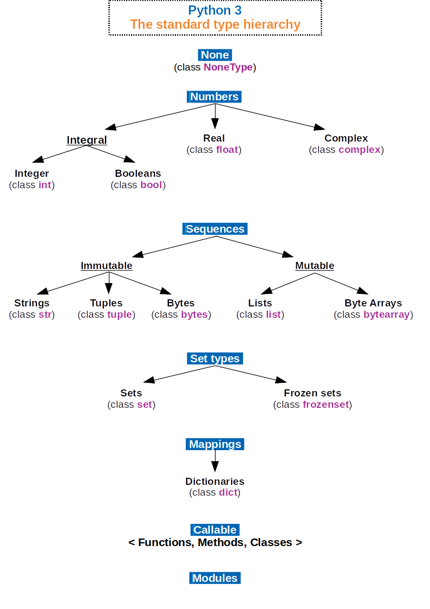

# Introduction: Data Analysis with Python

<div style="position: relative; width: 100%; aspect-ratio: 16 / 9;">
  <iframe src="https://av.tib.eu/player/71644" allowfullscreen style="position: absolute; top: 0; left: 0; width: 100%; height: 100%;"></iframe>
</div>

Generating and analyzing data is a central part of scientific research. Computer-based data analysis allows large datasets to be evaluated (partially) automatically. Readable scripting languages like Python ensure transparent data processing and enable analyses to be repeated or adapted "at the push of a button."

::: {.border}


Python logo by the Python Software Foundation is licensed under [GPLv3](https://www.gnu.org/licenses/gpl-3.0.html). The wordmark is trademarked: <https://www.python.org/psf/trademarks/>. The asset is available on [Wikimedia](https://en.m.wikipedia.org/wiki/File:Python_logo_and_wordmark.svg). 2008

:::

&nbsp;

Python appears as a simple console. Python code can be entered into the console or saved in a plain text file called a script. The program code is executed by an interpreter, which translates the script’s instructions into machine code for the specific computer system. This allows the script to run on different systems. Modern Python interpreters are not limited to ASCII characters and can also handle characters in [UTF-8](https://en.wikipedia.org/wiki/UTF-8), which extends ASCII to include special characters, such as German special characters.

Many features, such as code formatting, autocomplete, and error checking, are provided by an Integrated Development Environment (IDE).

``` {python}
#| echo: false
#| fig-cap: Software development with Python
#| fig-alt: "Flowchart of software development with Python. A script is written in the IDE, inputs can be entered in the console. The Python interpreter processes them into machine code, which the executing computer converts into a result and outputs."

# install package if necessary
# import subprocess
# subprocess.call(['pip', 'install', 'schemdraw'])
import schemdraw

from schemdraw.flow import *

with schemdraw.Drawing() as d:
    # Main path: IDE
    with d.container().label('Integrated Development Environment IDE'):
        d+= Box().label('Text Editor').at((0, 0))
        d+= Arrow().length(2).right().label("Script").at((4, 0))
        d+= (interpreter := Box().label('Python\nInterpreter')).at((5, 0))
    d+= Arrow().length(5).right().label("Machine Code", ofst = (0.7 , 0))
    d+= Box().label('Executing\nComputer')
    d+= Arrow().length(2.5).right().label("Result")
    d+= Box().label('Output')

    # Console side path
    d+= (console := Box().label('Console')).at((0, -3))
    d+= Wire("-|", arrow = "->").at(console.E).label('Inputs', loc = "bottom").to(interpreter.S) # .S + .E (or other direction anchors) must be set, -| defines a horizontal, right-angled edge

    d.draw()
```

## Fundamentals of Object-Oriented Programming
Python is an object-oriented programming language. Object-oriented programming is a system for bringing order to complex computer programs. In this section, the basic concepts of object-oriented programming with Python are introduced. You will learn the difference between an object, a class, and a data type.

### Classes, Types, Objects, Attributes
A Python program consists of various elements: operators and operands, functions and methods, values and variables, and much more. Everything in Python is an object.

Every object belongs to a class, for example, the class of integers. The class acts as a blueprint defining the *properties* and *behavior* of the object—such as which data it can store and which operations can be performed. A brief example: depending on their class, objects behave differently with the `+` operator.

```{python}
print(type(2), 2 + 2, "Integers are added.")
print(type('a' and '2'), 'a' + '2', "Strings are concatenated.")
print(type(True), True + True, "Boolean values are added.")
```

This is because the behavior of the `+` operator is defined for the classes integers (`int`), strings (`str`), and Boolean values (`bool`).  
It behaves differently with `None`, a class used to represent non-existent values:

```{python}
#| eval: false

print(None + None)
```

```{python}
#| echo: false

try:
  None + None
except TypeError as error:
  print(error)
```

Python has many classes. In Python, classes (`class`) are also called types (`type`). In earlier versions of Python, classes and types were still different. Nowadays, this distinction no longer exists, but both terms are still used in the language.

::: {.border}
{width="60%" fig-alt="Shown is a categorization of the standard types in Python. The categorization does not completely correspond to the categories of data types mentioned in the documentation. The type None for null values has no further subdivision. The category Numbers is subdivided into numeric values (integers, boolean truth values), real numbers (floats), and complex numbers. The category Sequences is subdivided into immutable (strings, tuples, bytes) and mutable (lists, byte arrays). The category Set Types is subdivided into sets and frozen sets. The category Mappings contains dictionaries. The category Callable includes functions, methods, and classes. In addition, there is the category Modules."}

Python 3. The standard type hierarchy. by Максим Пе is licensed under [CC BY SA 4.0](https://creativecommons.org/licenses/by-sa/4.0/deed.de) and available on [Wikimedia](https://commons.wikimedia.org/wiki/File:Python_3._The_standard_type_hierarchy.png). 2018
:::

&nbsp;

Which class or type an object belongs to can be determined using the `type()` function.

```{python}
print(type(print))
```

Attributes store properties of an object. They appear in the form `object.attribute` and are accessed without following parentheses. At this stage of the introduction, attributes have no practical relevance, but we will encounter them again later. A second form of attributes is the method. Methods are functions that belong to a specific class. Methods have the form `object.method()`, meaning they are called with following parentheses. We will learn how to use functions and methods in the upcoming chapters. How to determine the available attributes and methods of an object is explained in @nte-attribute and @nte-methods.

## Formatting program code
When formatting Python code, only a few points need to be considered. To produce output in Python, the function `print(input)` is used. This function outputs the argument `input`.

1. Numbers and operators can be entered directly. Text, more precisely a string, must be enclosed in single or double quotation marks; otherwise, Python interprets it as the name of an object. Strings can contain letters, special characters, and numbers.

```{python}
print(1 + 2)
print('123: Hello World!')
greeting_text = 'Hello Python!'
print(greeting_text)
```

2. Comments are marked with a preceding hash `#`. Comments indicate code that should not be executed or provide explanations.

```{python}
# A pure comment
# print("Python is great!") # commented-out code, followed by a comment
print("Python is pretty good.") # executable code, followed by a comment
```

3. Expressions must be on a single line. Longer expressions can be continued over multiple lines using the backslash `\` (there must be no `#` after `\`). Within functions such as `print()`, lines can be continued after each comma.

```{python}
variable1 = 15
variable2 = 25

# Line continuation using \
total = variable1 + \
    variable2

# Line continuation inside a function
print(variable1,
      variable2,
      total)
```

*In the example above, variables are created. We will deal with variables in the next chapter. However, I would like you to take a brief look at `variable1` and `variable2` again. We will come back to them later.*

4. The number of spaces between operands and operators can be arbitrary.

```{python}
print(1+0, 1 + 1, 1 +                  2)
```

5. Indentation with spaces indicates a cohesive code block. Within a code block, the same number of spaces must always be used. At least one space is required; beyond that, the number of spaces is flexible. Common conventions are 2 or 4 spaces.  
The following for-loop executes all statements in the indented execution block. The subsequent, non-indented line marks the beginning of a new statement that does not belong to the loop.

```{python}
for i in range(2):
    print(variable1)
    print(variable2)
print(total)
```

## Formatting Output
With so-called `f-strings`, you can create formatted strings. Formatted strings are created by prefixing the quotation marks with an `f`. Values and variables can be inserted using placeholders, which are indicated with curly braces `{}` and can include formatting instructions. The format specification inside the curly braces is simplified as follows:

```
{variable_name:width_type}
```

An f-string with placeholders without formatting information
```{python}
number1 = 5
number2 = 7
ratio = number1 / number2
print(f"The ratio of {number1} to {number2} is {ratio}.")
```

The number of decimal places to display can be set as follows: `{ratio:.2f}`.

  - `:` introduces the formatting instructions.

  - `.` indicates that formatting information for the digits after the decimal point follows.

  - `2` is the number of decimal places to display.

  - `f` specifies the representation of a floating-point number 'float'.

```{python}
print(f"The ratio of {number1} to {number2} is {ratio:.2f}.")
```

The same is possible with a value:
```{python}
print(f"The ratio is more precisely {0.7142857142857143:.3f}.")
```

A value for the total number of digits to display before the decimal point can be specified `{ratio:7.2f}`, or including leading zeros `{ratio:07.2f}`:
```{python}
print(f"The ratio of {number1} to {number2} is {ratio:7.2f}.")
print(f"The ratio with more precision is {0.7142857142857143:07.3f}.")
```

The decimal point counts as one character.

Commonly used format specifications are:

::: {.panel-tabset}
## Integers
Integers use the output type `d`.

| Format | Output |
|---|--------|
| `nd` | Uses n characters for the output |
| `0nd` | Uses n characters, padding with zeros if necessary |
| `+d` | Always shows the sign, even for positive numbers |

## Floating-Point Numbers
Floating-point numbers use the output types `f` and `e`.

| Format | Output |
|---|--------|
| `.mf` | Uses m digits after the decimal point |
| `n.mf` | Uses n characters total, with m digits after the decimal point |
| `n.me` | Same as above, but in scientific notation |

## Strings
Strings use the output type `s`.

| Format | Output |
|---|--------|
| `ns` | Uses n characters total |
| `<ns`, `>ns`, `^ns` | Left-align, right-align, or center the string within n characters |

:::

A complete list of all available format types can be found in the [Python documentation](https://docs.python.org/3/library/stdtypes.html#printf-style-string-formatting).

## Exercises
1. Floating-point numbers can be displayed in standard form, e.g., {1015.39:12.4f}, or in scientific notation, {1015.39:e}.
 
   - Modify the standard form so that only one digit appears after the decimal point. What do you notice?
 
   - Modify the scientific notation so that the exponent is displayed with `E` instead of `e`.

2. Convert the number 1015.39 to a string and display it right-aligned in a field of 12 characters.

3. Using formatted strings, print a table showing the columns $x$, $x^2$, and $x^3$ for integers from -2 to 2.

::: {#tip-solutionoutput .callout-tip collapse="true"}
## Sample Solution Output

:::: {.border}

1. Exercise
```{python}
# Modify the standard form so that only one digit appears after the decimal point.
# What do you notice?
print(f"standard form: {1015.39:12.4f}")
print(f"scientific form: {1015.39:e}")

print(f"form with one decimal place: {1015.39:12.1f}")

# Modify the scientific notation so that the exponent uses 'E' instead of 'e'.
print(f"change exponent to 'E': {1015.39:E}")
```


It is noticeable that the decimal place of the natural number is automatically rounded. When changing the decimal base to a large **E**, it will also be displayed as uppercase in the `print` output.

2. Exercise

```{python}
# 2.
# Convert the number 1015.39 into a string and display it right-aligned in 12 characters.
print(f"{"1015.39":>12s}")
```

3. Exercise

```{python}
# 3.
# Using formatted strings, print a table showing the columns x, x², and x³
# for integer values between -2 and 2.

x = -2
print(f"{x:>10d} {x**2:>10d} {x**3:>10d}")
x = -1
print(f"{x:>10d} {x**2:>10d} {x**3:>10d}")
x = 0
print(f"{x:>10d} {x**2:>10d} {x**3:>10d}")
x = 1
print(f"{x:>10d} {x**2:>10d} {x**3:>10d}")
x = 2
print(f"{x:>10d} {x**2:>10d} {x**3:>10d}")
```

Alternatively, a (more elegant) solution using a `for` loop is also possible:

```{python}
for x in range(-2, 3):
    print(f"{x:>12d} {x**2:>12d} {x**3:>12d}")
```

Sample solution by Marc Sönnecken.
::::


:::

&nbsp;  

[@Arnold-2023-datentypen-und-grundlagen; @Arnold-2023-funktionen-module-dateien; @Arnold-2023-datenanalyse-python]
