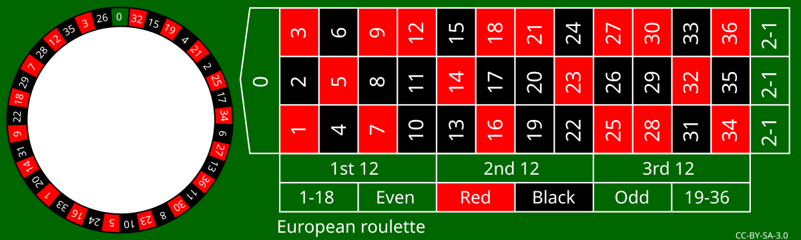

## Control Flow
Control flow allows you to manage the execution of parts of a program. Statements can be skipped or executed multiple times.

### Branching
Branching allows for conditional execution, where different parts of the script run depending on one or more conditions.

In Python, branching starts with the keyword `if`. This is followed by the branch condition and ends with a colon `:`. If the branch condition is true, the indented block of statements is executed.

```
if condition:
    block_of_statements
```

```{python}
# Example: Number smaller than a threshold

a = 7
if a < 10:
    print('The number', a, 'is smaller than 10.')
```

It is also possible to define an alternative block of statements that will be executed if the condition is false. This is implemented using the `else` keyword.

```
if condition:
    # condition is true
    statement_block
else:
    # condition is false
    statement_block
```

``` {python}
# Example: Number below a threshold with alternative output

a = 13
if a < 10:
    print('The number', a, 'is less than 10.')
else:
    print('The number', a, 'is not less than 10.')
```

Multiple conditions can also be used.
``` {python}
# Example: Number within the range between 10 and 20

num = 1
if num < 20 and num > 10:
    print('The number', num, 'is between 10 and 20.')
else:
    print('The number', num, 'is not between 10 and 20.')
```

Finally, several alternative conditions can be checked. This is possible by nesting branches.
```{python}
# Example: Number within the range between 10 and 20 using nested conditions

number = 12
if number > 10:
    print('The number', number, 'is greater than 10.')
    
    if number < 20:
        print('The number', number, 'is less than 20.')
        print('Therefore, the number is between 10 and 20.')
    else:
        print('The number', number, 'is greater than 20 and not within the desired range.')
else:
    print('The number', number, 'is less than 10 and not within the desired range.')
```

On the other hand, this is possible with the keyword `elif`.
```{python}
# Example: Number in the range between 10 and 20 using elif

number = 112
if number < 20 and number > 10:
    print('The number', number, 'is between 10 and 20.')
elif number < 10:
    print('The number', number, 'is less than 10 and not in the desired range.')
elif number > 20 and number <= 100:
    print('The number', number, 'is greater than 20, but not greater than 100.')
elif number > 20 and number <= 1000:
    print('The number', number, 'is greater than 20, but not greater than 1000.')
else:
    print('The number', number, 'is not between 10 and 20 and is greater than 1000.')
```

### Loops
Loops allow you to repeat instructions. In Python, `while` and `for` loops can be defined. Both require:

  - a **loop header**, which controls the execution of the block of statements, and
  
  - a **block of statements**, i.e., a group of instructions that is executed in each iteration of the loop.

The `while` loop requires only a single condition in the loop header and is the more general of the two. Any `for` loop can be rewritten as a `while` loop (by integrating a counter into the block of statements). Which type is used depends on the specific task.

#### while Loops
A `while` loop repeatedly executes the block of statements as long as the execution condition is true. The loop starts with the keyword `while`, followed by the execution condition. The loop header ends with a colon `:`. The indented block of statements is defined below it.

```
while condition:
    statement block
```


At the start of the loop and after each iteration, the condition is checked. If it is true, the block of statements is executed; if not, the loop ends and the next statement outside the loop is executed.
```{python}
# Example: Incrementing a variable value

# Set starting value
a = 5

# Define a loop that runs as long as a is less than or equal to 10
while a <= 10:
    # Loop block:
    
    # 1. Print the current value of a
    print('current value of a', a)
    
    # 2. Increment a by one
    a += 1

# Print the value after the loop
print('value of a after the loop', a)
```


::: {#wrn-infinite-loop .callout-warning appearance="simple" collapse="false"}
## Infinite Loop

`while` loops result in an infinite loop if the termination condition can never be met. For example, in the following loop, there is no way for the loop variable `x` to reach the value 5.

``` {python}
#| eval: false

x = 1

while x < 5:
  print(x)
```

In this case, you can stop the program execution by pressing `Ctrl` + `C`.

:::

#### for Loops
While the `while` loop runs as long as a condition is true, the `for` loop is controlled by a loop variable that iterates over a sequence. The syntax looks like this:

```
for loop variable in sequence:
  statement block
```

To define the loop header, the two keywords `for` and `in` are used, and the header ends with a colon `:`. The indented block following the header is the body of the loop.

The sequence is created using a range object, which is generated with the function `range(start=0, stop, step=1)`. `range()` accepts integer values as *positional arguments* and generates integers from `start` up to *but not including* `stop` with the step size `step`. It is important to note that Python counts **exclusively**, meaning it starts counting at 0 by default and the value passed as the `stop` argument is not included.

The `range()` function returns a range object, which does not immediately produce the expected output when used with `print()`.
```{python}
# range(start=1, stop=5) - step is not provided, so the default value step=1 is used
print(range(1, 5), type(range(1, 5)))
```


This behavior is called lazy evaluation ([lazy evaluation](https://en.wikipedia.org/wiki/Lazy_evaluation)): The values of the `range` object are only generated when they are needed. In the following code, the `range` object is iterated with a loop, and in each iteration, the value of the loop variable `i` is printed.

```{python}
for i in range(1, 5):
    print(i)
```

The `step` parameter allows you to control the increment.

```{python}
for i in range(1, 15, 3):
    print(i)
```

It is useful to convert the range object into a list or a tuple, collection types that will be covered in the next chapter.

```{python}
# Output even numbers from 1-10 as a list
print("List:", list(range(2, 11, 2)))

# Output odd numbers from 1-10 as a tuple
print("Tuple:", tuple(range(1, 11, 2)))
```

`start` and `stop` can also be negative. For ascending sequences, `stop` must always be greater than `start`.

```{python}
for i in range(-5, -1):
    print(i)
```

`step` can also be negative. In that case, a descending sequence of numbers is generated. For descending sequences, `start` must always be greater than `stop`.
```{python}
for i in range(-1, -5, -1):
    print(i)
```

A descending sequence can also be created using the `reversed(sequence)` function. The result differs depending on the approach, or a different input is needed to get the same result:

```{python}
# Descending sequence, but start is greater than stop
# The output remains empty
print(list(range(5, 0)))

# Using the reversed function works
print(list(reversed(range(0, 5))))

# For a negative step size, start must be greater than stop
print(list(range(0, 5, -1)))
print(list(range(5, 0, -1)))
```


##### List Notation

::: {.border}
The so-called list notation is a shorthand for for-loops. Loops written in list notation must fit on a single line and have the following syntax:

```{python}
squared_numbers = [value ** 2 for value in range(10, 0, -1)]
print(squared_numbers)
```

(@matthes2017python, p. 71)
:::

#### The Keywords break and continue
Sometimes it may be necessary to exit the block of a loop prematurely. For this, the keywords `break` and `continue` can be used. The keyword `break` causes the loop to terminate immediately. In contrast, the keyword `continue` ends the current iteration and moves on to the next iteration of the loop.

``` {python}
x = 0
while x < 10:

  x += 1

  # skip even numbers
  if x % 2 == 0:
    continue

  # stop the loop when x == 7
  if x == 7:
    break

  print(x)
```


### Exception Handling

Exception handling allows Python to execute alternative instructions when an error occurs. This is useful, for example, when reading datasets, as it lets you display the cause of error messages—a technique introduced in the [Reading Structured Datasets module](https://bausteine-der-datenanalyse.github.io/m-einlesen-strukturierter-datensaetze/output/book/).

In Python, there are two types of errors. The first are syntax errors, which Python reports with an error message similar to the following. Syntax errors are resolved by writing syntactically correct code.
```{python}
#| eval: false

print(1}
```

```{python}
#| echo: false

try:
  eval('print(1}')
except SyntaxError as error:
  print(str(error)[:58])
```

The second type of errors are exceptions, which can occur even in syntactically correct program code. Exceptions also result in error messages.

```{python}
#| eval: false

# Example 1: Division by zero
print(1 / 0)
```

```{python}
#| echo: false

try:
    print(1 / 0)
except ZeroDivisionError as error:
    print(error)
```

```{python}
#| eval: false

# Example 2: undefined variable
print(undefined_variable)
```

```{python}
#| echo: false

try:
    print(undefined_variable)
except NameError as error:
    print(error)
```

Error messages like these can be handled in Python using [exception handling](https://docs.python.org/3/tutorial/errors.html). This is initiated with the keyword `try`, which is completed with a colon `:`. In the next line, an indented block of statements follows that should be tested for exceptions. *Note: The block of statements is actually executed, so changes to data or files are possible.* Afterwards, the keyword `except` is used—again followed by a colon `:` and, in the next line, an indented block of statements—to define what should happen when an exception occurs. Optionally, the keyword `else` can be used following the same pattern to define another block of statements that is executed *in addition* when the block under `try` runs successfully. The general structure looks as follows:

```
try:
    statement_block_1
except:
    statement_block_if_statement_block_1_raises_an_exception
else:
    optional_statement_block_if_statement_block_1_does_not_raise_an_exception
```

Using exception handling, we can display the elements that cause an error.

```{python}
a = 1
b = 2

try:
    difference = a - b
except:
    print(f"The difference between {a} and {b} could not be calculated.")
else:
    print(f"The difference between {a} and {b} is {difference}.")
```


```{python}
a = 1
b = 'abc'

try:
    difference = a - b
except:
    print(f"The difference between {a} and {b} could not be calculated.")
else:
    print(f"The difference between {a} and {b} is {difference}.")
```

It is also possible to intercept and output the error message. To do this, modify the line `except:` as follows: `except Exception as error:`

```{python}
a = 1
b = 'abc'

try:
    difference = a - b
except Exception as error:
    print(f"The difference between {a} and {b} could not be calculated.")
    print(error)
else:
    print(f"The difference between {a} and {b} is {difference}.")
```


## Control Flow Exercises
1. Write a program that counts from 1 to 25 and from 38 to 50, and prints every value that is divisible by 7 using `print()`.

2. Roulette: Write a program that checks whether a given number is within the valid range of the roulette table. If not, it should display an error message. If it is, the program should output whether the number is:

  - even or odd,
  
  - red, black, or green,
  
  - low (1-18) or high (19-36), and
  
  - in the 1st, 2nd, or 3rd dozen.

:::: {.border}

{fig-alt="Roulette table: roulette wheel with numbered layout." width="90%"}

European roulette by Betzaar.com is licensed under [CC 3.0 BY-SA](https://creativecommons.org/licenses/by-sa/3.0/deed.en) and available on 
[wikimedia.org](https://commons.wikimedia.org/wiki/File:European_roulette.svg). 2010
::::

&nbsp;

::: {.callout-tip collapse="true"}
## Sample Solution for Control Flow Exercises

:::: {.border} 

1. Exercise
```{python}
# Write a program that counts from 1 to 25 and from 38 to 50, printing each value divisible by 7 using print()

i = 0
while i < 50:
    i += 1
    if i > 25 and i < 38 or i % 7 != 0:
        continue
    else:
        print(i)

# Alternative using lists
# Note: as mentioned in the "Loops" section, the stop value of the range function must be one higher than the last desired number, because Python counts exclusively
numbers = list(range(1,26)) + list(range(38,51))
for i in numbers:
    if i % 7 == 0:
        print(i)
```

2. Exercise
```{python}
# Define the integer to check as a variable
x = 10

# The red and black numbers are defined as lists (a tuple would also work here)
red_numbers = [1,3,5,7,9,12,14,16,18,21,23,25,27,28,30,32,34,36]
black_numbers = [2,4,6,8,10,11,13,15,17,19,20,22,24,26,29,31,33,35]

# The first if-statement checks whether the number is within the valid range. If not, it jumps directly to the "else" branch below
if x >= 0 and x <= 36:

    # Inside this if-statement, there are further if-statements that check other characteristics:

    # Check whether the number is even or odd
    if x % 2 == 0:
        print("Number is even")
    else:
        print("Number is odd")

    # Check whether the number is red, black, or green
    if x in red_numbers:
        print("Number is red")
    elif x in black_numbers:
        print("Number is black")
    elif x == 0:
        print("Number is green")

    # Check whether the number is high or low
    if x >= 1 and x <= 18:
        print("Number is low")
    elif x >= 19 and x <= 36:
        print("Number is high")
    
    # Check which dozen the number belongs to
    if x >= 1 and x <= 12:
        print("Number is in the 1st dozen")
    elif x >= 13 and x <= 24:
        print("Number is in the 2nd dozen")
    elif x >= 25 and x <= 36:
        print("Number is in the 3rd dozen")
    else:
        print("Number is not in any dozen")
    
else:
    print("Number is not within the valid range.")
```

Sample solution by Marc Sönnecken and Maik Poetzsch

::::
:::

&nbsp;  
(@Arnold-2023-schleifen-abzweigungen)
