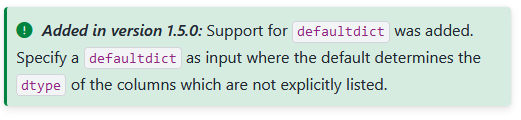
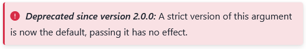
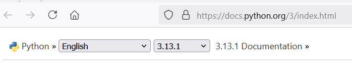

# Functions: Basics
Functions are subroutines that bundle program instructions so that parts of a program can be reused multiple times. This allows a program to be written more quickly and makes it easier to read. As you can see in the [documentation](https://docs.python.org/3/library/functions.html), Python comes with a manageable number of basic functions. This chapter teaches the general usage of functions included in Python.

Python is continuously evolving: new versions with new features are released regularly. Therefore, this chapter also provides a number of tips on how to read Python's documentation. This is especially relevant when extending Python extensively with modules. For example, functions in the Pandas module often have dozens of documented parameters.

::: {#tip-documentation .callout-tip collapse="false"}
## Documentation
The most important tip first: **Use the documentation!** Even if you are familiar with a function, make sure to check that you are up to date. This way, you get a complete overview of default and optionally available parameters. You also notice changes in function behavior and avoid unexpected errors.

:::: {layout="[1, 1]"}

{fig-alt="Notice of a new feature in Python"}

{fig-alt="Notice of a deprecated feature in Python"}

::::

Pay attention to the correct version of the documentation.

{fig-alt="Documentation version selection menu" width="80%"}

:::

## Functions and Methods
In Python, there are two types of callable objects: functions and methods.

### Functions
Functions can take objects of any data type as input.  
Functions are called using their function name followed by parentheses `()`. An example is the `print()` function:

```{python}
var_str = 'ABC'
var_int = 26
var_bool = True

print("The variable var_str has type", type(var_str))
print("The variable var_int has type", type(var_int))
print("The variable var_bool has type", type(var_bool))
```

Functions must always return a value. If functions cannot or should not return a value, the value `None` is returned, which indicates a non-existent value.

```{python}
res = print(15)
print(res)
```

Functions can be nested and thus executed from the inside out in sequence. In this code example, first the sum of two numbers is calculated, and then the boolean value of the result is determined. This value is then output using the `print` function.

```{python}
print(bool(sum([1, 2])))
```

### Methods
Methods are a feature of object-oriented programming languages. In the previous chapter, it was explained that in Python, objects belong to a specific type or class, and depending on the values stored within them, they have an appropriate data type. Methods are functions that belong to a specific class and are only available for objects of that class. Methods can also be defined for multiple classes. Methods are called by appending a dot `.` to the object followed by the method name: `variable.method` or `(value).method`. For example, `.upper()`, `.lower()`, and `.title()` are methods defined for strings.

```{python}
awesome_text = "Python 3.12 is awesome."

print(awesome_text.upper())
print(awesome_text.lower())
print(awesome_text.title(), "\n")

print(("It also works with values placed in parentheses.").upper())
```

Methods like `.lower()` are not available for objects with an inappropriate data type.

```{python}
#| eval: false

print((1).upper())
```

```{python}
#| echo: false
try:
  print((1).upper())
except AttributeError as error:
  print(error)
```

Methods can be chained and executed one after another. In this example, the string 'Cat' is converted to lowercase, and then the frequency of the letter 'c' is counted.

```{python}
print('Cat'.lower().count('c'))
```

Which methods are available for an object can be determined using the function `dir(object)`. However, the output of this function is often very extensive. To select the relevant entries, the output needs to be filtered. This is not strictly necessary—interested users can refer to @nte-methods.

::: {#nte-methods .callout-note collapse="true"}
## Determining an Object's Methods

The function `dir(object)` can be used to display the methods available for an object. However, it also shows the attributes and methods of the object's class, so the output is often very extensive. For example, for the integer 1:

```{python}
print(dir(1))
```

To limit the output to methods, the following list comprehension can be used:

```{python}
object_ = 1

methods = [attr for attr in dir(object_) if callable(getattr(object_, attr))]
print(methods)
```

Methods enclosed with double underscores are defined for the class. The following function removes methods with double underscores from the output:

```{python}
object_instance = 1

attributes = [attr for attr in dir(object_instance) if (callable(getattr(object_instance, attr)) and not attr.startswith('__'))]
print(attributes)
```

In the case of an integer, methods (to distinguish from floating-point numbers in enclosing parentheses) can be called as follows:

```{python}
(1).as_integer_ratio()
```

Methods of the object 'awesome_text':

```{python}
object = awesome_text

attributes = [attr for attr in dir(object) if (callable(getattr(object, attr)) and not attr.startswith('__'))]
print(attributes)
```

:::

## Parameters
Many functions and methods can accept multiple parameters, separated by commas. The values passed to a function are called arguments ([Python Documentation](https://docs.python.org/3/faq/programming.html#faq-argument-vs-parameter)). [Parameters](https://docs.python.org/3/glossary.html#term-parameter) control the execution of a program. The parameters available for the `print()` function are listed in the [function documentation](https://docs.python.org/3/library/functions.html#print):

```
print(*objects, sep=' ', end='\n', file=None, flush=False)
```

`*objects`, `sep`, `end`, `file`, and `flush` are the parameters of the `print()` function. 

  - Parameters without an equal sign `=` must be provided when calling the function or method. Parameters with an equal sign `=` are optional and can be provided during the call.

  - The values after the equal sign indicate the default values of the parameters. These are used if an argument is not explicitly passed during the call.

::: {#tip-default-values .callout-tip collapse="true"}
## Exceptions for Default Values
The values listed in a function's definition are not always the actual default values. Therefore, it is recommended to read the parameter descriptions when using a function.

Some functions use the keyword `None` to indicate the default value. The value `None` serves as a placeholder.
An example is the NumPy function [numpy.loadtxt()](https://numpy.org/doc/stable/reference/generated/numpy.loadtxt.html). 

```
numpy.loadtxt(fname, dtype=<class 'float'>, comments='#', delimiter=None, converters=None, /
              skiprows=0, usecols=None, unpack=False, ndmin=0, encoding=None, max_rows=None, /
              *, quotechar=None, like=None)
```

- For the parameter `delimiter`, the default value is listed as the keyword `None`. However, according to the function description, the actual default is whitespace: "The default is whitespace."

- The parameter `usecols` also has the default value `None`: "The default, None, results in all columns being read."

Another example is the function [pandas.read_csv()](https://pandas.pydata.org/docs/reference/api/pandas.read_csv.html#pandas.read_csv). Some arguments have the default value `<no_default>`. (Only selected parameters are shown below).

```
pandas.read_csv(sep=<no_default>, verbose=<no_default>)
```

From the description, the actual default values can be seen:  
sep : str, default ','  
verbose : bool, default False  

:::

  - In Python, arguments can either be passed as a positional argument. This means Python expects arguments in a fixed order corresponding to the parameters in the function definition. Alternatively, arguments can be passed as keyword arguments, where inputs are mapped according to the parameter name. By default, arguments can be passed either positionally or by keyword. Deviations from this are indicated by the symbols `*` and `/` (see the tip below).

::: {#tip-special-characters .callout-tip collapse="true"}
## Positional and Keyword Arguments, *args and **kwargs
The symbols `*` and `/` indicate which parameters can or must be passed positionally or as keyword arguments.

:::: {.border}

| Left side | Separator | Right side |
|:---:|:---:|:---:|
| positional-only arguments | / | positional or keyword arguments |
| positional or keyword arguments | * | keyword-only arguments |

(<https://realpython.com/python-asterisk-and-slash-special-parameters/>)
::::

&nbsp;

An example of the `*` separator is the `glob` function from the module of the same name. The `pathname` parameter can be passed positionally (first position) or as a keyword. The other parameters must be passed as keyword arguments.

```
glob.glob(pathname, *, root_dir=None, dir_fd=None, recursive=False, include_hidden=False)
```

Both control characters can appear within a function definition, but only in the order `/` and `*`. In the reverse order, it would be impossible to pass arguments. An example is the `sorted` function. The first parameter must be passed positionally, while the `key` and `reverse` parameters must be passed as keywords.

```
sorted(iterable, /, *, key=None, reverse=False)¶
```

:::: {.callout-warning appearance="simple"}
## Exceptions
Some functions deviate from the usual pattern, for example the functions `min()` and `max()`. They are defined (among others) in the following form:

```
min(iterable, *, key=None)
max(iterable, *, key=None)
```

Both functions accept the `iterable` parameter, but not as a keyword.
::::

Many functions can accept an arbitrary number of arguments, either positionally or as keywords. This is generally indicated by the keywords `*args` (positional arguments) and `**kwargs` (keyword arguments). The difference is marked by the single or double asterisk, and the keywords themselves can be replaced (as with the function `print(*objects)`). The keyword `*args` also corresponds to the `*` symbol in the function definition, meaning that only keyword arguments can follow it. More information can be found [here](https://book.pythontips.com/en/latest/args_and_kwargs.html).
:::

In the function definition of `print()`, `*objects` is a positional parameter (always in the first position), has no default value, and can accept an arbitrary number of arguments (n inputs are placed in the first n positions). The other parameters of the `print()` function are optional and must be passed as keyword arguments.

## Function Exercises
1. True or False: Methods are available depending on the data type of a value or an object.

2. Print the three values 1, 2, and 3 using `print()`. Parameterize the function so that the output looks like this:

```{python}
#| echo: false

print(1, 2, 3, sep = "_x_")
```

3. Look up the function [bool()](https://docs.python.org/3/library/functions.html#bool) in the documentation.

  - Which parameters does the function accept, and which of them are optional?

  - Which arguments are passed positionally and which can be passed as keyword arguments? Is the method of passing fixed or flexible?

::: {.callout-tip collapse="true"}
## Solutions
Exercise 1: correct

Exercise 2
```{python}
#| output: false

print(1, 2, 3, sep="_x_")
```

Task 3: The function bool() has an optional argument object with a default value of False. The argument must be passed positionally.
:::
